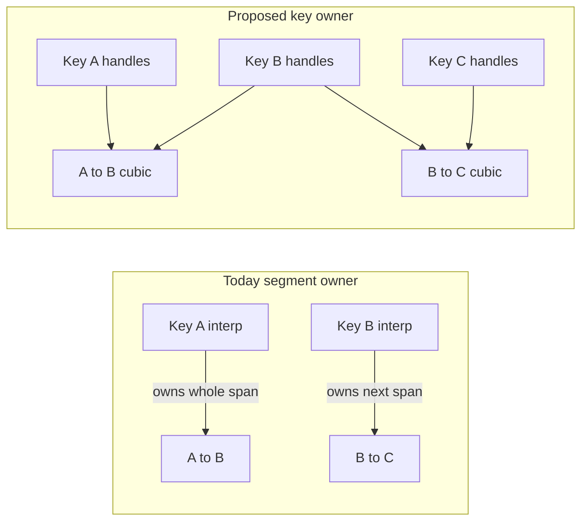

# Timeline key rework (per-key Bézier)

## The actual bug

Today `interp` on key **A** picks the **evaluator for the whole A→B span** ([www/js/timeline.js](www/js/timeline.js) `evalAxis`, [server/core/timeline.py](server/core/timeline.py) `eval_axis_at`):

- `linear` / `ease_*` ignore handles and remap the entire segment.
- `bezier` / `smooth` use `A.out` + `B.in`, but Smooth is the only mode that feels “about this key.”

That is why Ease in/out changes the hole to the next key, while Bézier only shapes this key. Docs already admit the segment model ([docs/timeline-panel-manual.md](docs/timeline-panel-manual.md) “outgoing segment”).

## What other tools do

**Dragonframe Arc** ([Using Dragonframe 2026.pdf](E:/GITHUB/SliderDMC/DragonFrameSource/Using%20Dragonframe%202026.pdf), same list in 2024): styles are **on the key**, not the span.

- Auto-smooth (blue ring)
- Ease in and out (purple diamond, auto-ease)
- Linear
- Ease-to-linear (linear middle, eases at the ends of a run)
- Bézier, plus contextual **Ease into this key** / **Ease out of this key**
- Feathering only on Bézier (not linear / ease-to-linear)

**After Effects / Blender / Maya** all agree on one cubic, with the mode as a **handle constraint at the key**:

- AE: Linear, Auto Bézier, Continuous Bézier (aligned), Bézier (broken). Easy Ease sets **this key’s** incoming/outgoing speed to 0 (influence ~33%), not a CSS ease over the next span.
- Blender: interpolation can still be per-segment, but the useful part is **handle type** on the key: Auto, Aligned, Free, Vector.
- Maya: spline / linear / flat / broken vs unified **tangents on the key**. Linear in-tangent straightens the incoming span; linear out-tangent straightens the outgoing span.

**Kessler kOS** (closest product graph to ours): everything is a Bézier. Marketing and App Store copy are explicit that ease is **per key**, not per span: “Add and customize ease-ins and ease-outs **to every keyframe**.” Same listing: “link **each side of the keyframe** to match.” Graph options:

- **Lock Handles** = Aligned (in/out stay matched). Unlock = Free. Lock state is **per keyframe** (kOS 5.2.7 bugfix: “locking state of key frames and handles were not persistent”).
- **Ramping** (renamed from “Smooth Curve”) = Auto.
- Hardware CineShooter *without* kOS is the dumb 2-key model: one global **Ramp %** + **Damping** for the whole move. kOS is where they moved that onto the graph.

That is the same design we want: cubic handles on the key, Aligned = lock both sides, Auto/Ramping = auto, Ease in/out = flatten that key’s handles.

**MRMC Flair** (high-end, different architecture, same idea at the waypoint):

- A move is **waypoints**. Motors run waypoint → waypoint so they **arrive at the next waypoint on time**. The graph is the axis curve, plus a separate **speed profile**.
- **Curve Type** is a **job-level** pick (~10 types, matching “Fluid 10 curve types”): Splines, Beziers, Linears, Cubics, Quadratics, Quintics, Quik Cubics, Bounces, FSplines, Quik Quintics, Ramps.
- **Profile Type**: Bezier Form / Cubic Form / **Fairings Form**.
- **Fairings** are the MoCo name for ease at a waypoint: User vs Computer; per-axis “50 up and 50 down” (percent of the span used to ramp into / out of that waypoint). Training: “Controlling fairing”, “Waypoint fairings”, “3D fairing”. Flair 7 added **global fairing fields** for a whole-move tweak.
- Start/Stop: quickly vs path run-up / along path. Holds: still vs can move.

We should **not** clone 10 curve types or a separate speed-profile overlay. Take this: Flair does not CSS-ease the next span. Fairing **up/down lives on the waypoint**. Our handle length is that fairing (horizontal + long = long stop; Dragonframe **feathering** is the same knob).

**edelkrone** (no F-curve at all):

- **Keypose** snapshots + **Sequencer / Motion Chain**. Each **transition** has its own speed; duration follows. Sequencer also exposes **slow-in / slow-out** on that transition (YouTube sequencer: independent speed plus slow-in/out).
- Global speed vs acceleration; firmware 3.3 **prioritizes acceleration** so a short hop may never reach cruise.
- **Flow** (announced): play keyposes as one continuous path **without stop-and-go**. That is Auto-through-keys vs Ease (zero velocity, stop at the pose).
- Motion Chain: speed is “how you **arrive** at this keypose” — again a property of the pose, not a CSS remap of the next interval.

Do not copy edelkrone’s speed-only UI. Copy the operator language: *arrive slow*, *leave slow*, *flow through* vs *stop at this pose*.

**eMotimo Spectrum** and Kessler hardware (no kOS): start/end + one global ramp. Not a graph editor.

Resolve-style Ease in/out (which this editor currently copies) is the model to leave. Kessler + Dragonframe + Flair fairings all agree with per-key.

## Names (chosen: Blender)

Usual names for the same three handle constraints, plus Linear:

- **Blender (chosen):** Auto, Aligned, Free, plus Linear (Blender’s handle name for straight is Vector; we keep **Linear** because MoCo operators already know it).
- After Effects: Auto Bézier, Continuous Bézier, Bézier, Linear.
- Maya: Spline / Auto, Unify tangents, Break tangents, Linear. Flat = our Ease (horizontal).
- Dragonframe: Auto-smooth, Bézier, Linear (no aligned/broken split; you lock by not breaking handles).
- Kessler: Ramping, Lock Handles, unlocked, Linear.
- Illustrator: Smooth, Corner, Symmetric — here “Smooth” means *aligned*, not auto. That clash is why we drop Smooth/Soft/Hard.

Stored `interp` strings: `auto`, `aligned`, `free`, `linear`. Accept legacy `smooth` as `auto` and `bezier` as `free` on load. Version stays 1.

## Suggestion

**Every key is a cubic Bézier.** Playback always uses `A.out` + `B.in`. `interp` only says how this key’s two handles are constrained or auto-built.

### Sticky modes (the key)

- **Auto** — DF auto-smooth, Kessler Ramping, AE Auto Bézier, edelkrone Flow. Dashed, no dots. In and out **same slope**. Auto-rebuilt. Consecutive Auto keys solved as one run.
- **Aligned** — Kessler Lock Handles, AE Continuous Bézier, Blender Aligned. Solid + dots. In and out **always same slope**; lengths independent. User-owned; not overwritten.
- **Free** — Kessler unlocked, AE Bézier, Blender Free. Solid + dots. In and out **independent** (corner).
- **Linear** — DF Linear, Flair Linears, Blender Vector, Maya linear tangent. Dashed toward neighbours, no dots. Auto handles **point at prev/next**. Rebuild when neighbours move. A span is fully straight only if **both** ends are Linear (or vector-snapped).

Linear as a sticky auto mode is the one addition to the three handle types. If Linear is only a one-shot bake, nudging a key later bends the “straight” span. That is the most common MoCo shape, so it should stay straight the way Auto stays smooth.

Drop `ease_in` / `ease_out` / `ease_inout` as evaluators.

### One-shot presets (toolbar, not sticky)

These write handles on **the selected key only**, then leave it **Aligned** (horizontal pair stays aligned):

- **Ease in** = flatten **in** handle (`dy = 0`, `dx = -dt/3`) — arrive at this key. Dragonframe “Ease into the keyframe.” Kessler ease-in on that key. Flair fairing **down**. AE Easy Ease In. edelkrone slow-in / “arrive at this pose.”
- **Ease out** = flatten **out** handle — leave this key. DF “Ease out of.” Kessler ease-out on that key. Flair fairing **up**. AE Easy Ease Out.
- **Ease in/out** = both handles horizontal. DF auto-ease. Handle **length** is Flair’s fairing % / DF feathering (not a different evaluator).

**Naming change:** today’s “Ease in” is CSS-on-the-segment (slow start of A→B). After this, Ease in/out mean **into/out of this key**, matching Dragonframe. Icons should show a flat **at the diamond**, not a whole-span S.

Typical 2-key slider move (rest → rest): Ease **out** on the first key, Ease **in** on the last. That used to be one click of Ease in/out on the first key; that click was the bug.

### Handle drag modifiers

| Keys           | Behaviour                                                                                                                                                                                                    |
| -------------- | ------------------------------------------------------------------------------------------------------------------------------------------------------------------------------------------------------------ |
| **Ctrl**       | Horizontal (`dy = 0`), latched for the drag (keep current).                                                                                                                                                  |
| **Shift**      | Symmetric: opposite handle same **distance** (and collinear). Aligned already collinear, so Shift only equalizes length. Free temporarily acts like Aligned + equal length.                                  |
| **Ctrl+Shift** | Horizontal + equal `                                                                                                                                                                                         |
| **Alt**        | Snap this handle onto the chord toward the neighbour (“as linear as possible”). Length still editable along that line; clamp so the control point stays inside the span. Does **not** rewrite the other key. |

Dragging an Auto handle: **Alt** (or any handle grab) converts that key to **Aligned**, keeping current auto slope (today it becomes `bezier` / Free). Without Alt, Auto handle hits stay key-drags (as now).

Dragging an Aligned handle rotates **both** (keep slope). Free moves one side only, unless Shift.

### Auto runs (your “recursion”)

Do not keep per-key Catmull-Rom that also rewrites Linear/Ease neighbours ([applySmoothLane](www/js/timeline.js)).

1. Find maximal runs of consecutive **Auto** keys.
2. Fit a cubic spline through the run (C2 inside the run — what motors actually want).
3. End conditions: if the key before/after the run is Aligned/Free/Linear, **clamp** that end tangent to that neighbour’s adjacent handle. Do **not** write neighbour handles.
4. Convert Hermite tangents to Bézier: `out = {dx: dt/3, dy: m*dt/3}` (and the matching `in` on the same Auto key).
5. Optional clamp: if an Auto span would overshoot the key values (S-shape), shrink tangents (Blender Auto Clamped). Worth doing for MoCo travel limits.

Only Auto keys get new `in`/`out`. Python stays “evaluate stored cubics” and does not need the spline solver.

### Eval simplification

`evalAxis` / `eval_axis_at`: always cubic. Map legacy `smooth` → Auto path (already treated as bezier). After load-migration, `linear` / `ease_*` can remain as a **read fallback** for one release, or disappear once JS bakes them.

## File format: stay on version 1

Keep `"format": "slidermoco-timeline"` and `**"version": 1**` on export ([www/js/app.js](www/js/app.js) `timelineObj`). Do **not** bump to 2.

Same JSON shape: `t`, `value`, `interp`, `in`/`out`. New sticky names (`auto`, `aligned`, `free`; `smooth` → `auto`, `bezier` → `free`) go in the existing `interp` string. Import already ignores unknown `version` and only checks `format` + `lanes`. Old files with `ease_*` / `linear` / `bezier` / `smooth` stay valid version-1 files; bake them on load so the curve matches, then a re-export is still version 1 with baked handles.

## Load migration

On import / `setLanes`, bake old `interp` values so the curve matches (still version 1):

- `linear` on A: set `A.out` and `B.in` to vector (chord/3), then `A.interp = "linear"` (sticky).
- `ease_in` on A: `A.out` horizontal; `B.in` along `3 * chord` (matches `u³` end slope). Then `A.interp = "aligned"` if both A handles aligned, else `"free"`. **Do not** keep ease as the evaluator.
- `ease_out` on A: `A.out` along `3 * chord`; `B.in` horizontal.
- `ease_inout` on A: both `A.out` and `B.in` horizontal.
- `bezier` → `free`.
- `smooth` → `auto`.

Baking `B.in` for a linear/ease **segment** is required to keep the old shape; that is a one-time conversion, not ongoing mutation.

Default new key: **Auto** (DF / Blender-like). Double-click-add can stay Auto with handles sampled from the curve slope, then the Auto pass overwrites them.

## UI

### Graph: one key shape per sticky mode

Today every key is the same filled diamond ([_drawLane](www/js/timeline.js) rotate 45° + `fillRect`). That hides the mode until you select it. AE, Dragonframe, and Kessler all put the type on the key itself (circle vs diamond vs ring). Use **shape**, not extra colours (lanes already own colour).

Recommended (reads at ~10 px, distinct silhouettes):

- **Auto** — hollow **circle**. Round = continuous; hollow = computed (pairs with dashed handles, no dots). Same idea as AE Auto Bézier and DF’s blue ring.
- **Linear** — hollow **diamond** (keep the current 45° square, stroke only). Hollow = computed vector; diamond = AE Linear. Distinct from Auto’s circle.
- **Aligned** — filled **diamond**. Same silhouette as Linear, filled = you own the handles; collinear handle bar through the key when Handles is on.
- **Free** — filled **square** (axis-aligned). Square = corner / broken, Illustrator “corner point.” Handles at independent angles.

Selection: white stroke around the glyph (as now). Hit area stays `HIT_R`; do not shrink circles.

Do **not** give Ease its own key shape. Ease is a handle preset on Aligned: horizontal handles already say “stopped at this key.” Extra glyphs (DF purple diamond) fight the four-mode set. Optional later: a tiny tick on a filled diamond when both `dy === 0`.

Computed vs authored, one rule: **hollow = auto-rebuilt (Auto, Linear), filled = user handles (Aligned, Free).**

### Toolbar buttons: same glyph + a mini-curve

Current icons are all “a curve with no key.” Linear’s diagonal is the only one that still matches. Ease in/out/in-out draw CSS **segment** easings, which is the old bug. Bézier’s two dots are close to Free. Smooth’s sine is close to Auto but has no key mark.

Each **sticky** button = the graph glyph in the middle + a 2–3 px curve that shows the constraint:

- **Auto** — hollow circle on a sine (no handle dots). Reuse the current Smooth path, drop a circle on the midpoint.
- **Aligned** — filled diamond, one straight handle line through it, gentle S on both sides (C1).
- **Free** — filled square, two handle ticks at **different** angles, curve with a kink at the square.
- **Linear** — hollow diamond sitting on a straight diagonal (keep today’s Linear stroke, add the diamond).

Each **Ease preset** = a **key mark** (filled diamond) at the place that flattens, so it reads as “this key,” not “this span”:

- **Ease in** — key on the **right**; curve arrives flat (horizontal into the key). Arrive / DF “ease into.”
- **Ease out** — key on the **left**; curve leaves flat. Leave / DF “ease out of.”
- **Ease in/out** — key in the **center**; both sides horizontal (plateau at the diamond).

Do not keep the current Ease-in icon (flat at the left of a segment) — that is CSS ease-in of A→B.

### Toolbar layout

[www/index.html](www/index.html) (and board copy):

1. Sticky group: Auto | Aligned | Free | Linear
2. A 1 px divider
3. Preset group: Ease in | Ease out | Ease in/out

Sticky buttons get `aria-pressed` / an active class from `selectedKey().interp`. Ease buttons light only when that key’s matching handle(s) are horizontal (`|dy|` ≈ 0). Today the row never shows which mode is selected (`onSelChange` only syncs T/V).

Titles: `Auto`, `Aligned`, `Free`, `Linear`, `Ease in (into this key)`, `Ease out (out of this key)`, `Ease in/out`.

## Files (keep www ↔ board and JS ↔ Python in lockstep)

- [www/js/timeline.js](www/js/timeline.js) — eval, Auto spline, Linear rebuild, drag modifiers, `setInterp` vs `applyEasePreset`
- [board/www/js/timeline.js](board/www/js/timeline.js) — identical
- [server/core/timeline.py](server/core/timeline.py) + [board/timeline.py](board/timeline.py) — cubic-only eval; optional legacy fallback
- [www/index.html](www/index.html), [www/js/app.js](www/js/app.js), [board/www/js/project.js](board/www/js/project.js) — toolbar + defaults
- [tests/test_timeline.py](tests/test_timeline.py) — bezier parity, linear bake, ease bake, Auto handles already present
- [docs/timeline-panel-manual.md](docs/timeline-panel-manual.md) — replace “outgoing segment” with per-key rules and modifiers; `interp` enum `auto`/`aligned`/`free`/`linear`, `**version` stays 1**

## Out of scope unless you want them

- Dragonframe **Ease-to-linear** (linear middle of a run with eases at the run ends) — Linear on middle keys + Ease on the ends.
- Flair’s 10 job-level curve types, separate speed-profile overlay, or global fairing % fields.
- edelkrone speed/acceleration sliders instead of a graph.
- Feathering / time warp / multi-select keys.
- Changing Python to re-solve Auto (handles are saved from JS).

