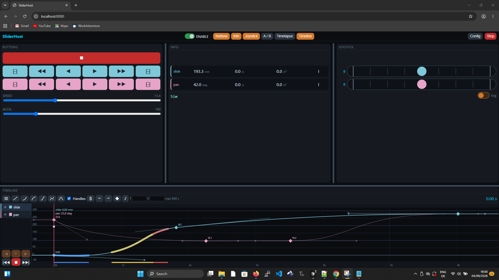

# SliderMoCo

**WebSocket GUI + asyncio server** for DIY motorized camera sliders. Sibling of [SliderCtrl](https://github.com/fablab-wue/SliderCtrl) (physical panel) and [SliderMC](https://github.com/fablab-wue/SliderMC) (motors). Absorbs unpublished SliderWeb.



```text
Phone / tablet / PC browser
        HTTP + /ws JSON  (axes[])
Pico W / Pico 2 W / ESP32     or     PC / Raspberry Pi Zero (this host)
        UART MC lines (one SliderMC now)
SliderMC
```

## Quick start (no hardware)

From the repo root (CPython 3):

```text
python -m server.host
```

Open http://127.0.0.1:8080/

Mock kinematics stand in for SliderMC. USB later:

```text
python -m server.host --port COM5
```

(`pyserial` required for `--port`.)

Tests: `python tests/test_timeline.py`

## Manuals

| Doc | For |
| --- | --- |
| [User manual](docs/user-manual.md) | Architecture, desktop vs phone, index of panel chapters |
| [Builder](docs/builder-manual.md) | PC host, Pico/ESP32 flash, UART, Wi-Fi |
| [Buttons](docs/buttons-panel-manual.md) · [Info](docs/info-panel-manual.md) · [Joystick](docs/joystick-panel-manual.md) · [A/B](docs/ab-panel-manual.md) · [Timelapse](docs/timelapse-panel-manual.md) · [Timeline](docs/timeline-panel-manual.md) | One chapter per panel |
| [Keyboard](docs/keyboard-control-manual.md) | Desktop keys (Joystick footer) |
| [Config](docs/config-manual.md) · [Phone](docs/phone-manual.md) | Dialog and narrow-width tabs |
| [Safety](docs/safety-manual.md) · [Session](docs/session-manual.md) · [Soft window](docs/soft-window-manual.md) · [Watchdog](docs/watchdog-manual.md) | ENABLE, cruise, limits, sleep |
| [Wi-Fi](docs/wifi-manual.md) · [Troubleshooting](docs/troubleshooting-manual.md) · [Production](docs/production-checklist-manual.md) | Bring-up and field |
| [Import / export](docs/import-export-manual.md) · [CLI](docs/cli-manual.md) · [Camera](docs/camera-trigger-manual.md) | Files, raw lines, shutter |
| Full index | [User manual](docs/user-manual.md) |

## Layout

```text
www/                 shared UI (phone tabs + PC splitters + Resolve-style curves)
server/core/         timeline.py, mock_mc.py (CPython + MicroPython)
server/host/         PC / Raspberry Pi Zero entry (`python -m server.host`)
server/board/esp32/  ESP32 pin overlay
board/               Pico W / Pico 2 W / ESP32 flash tree (copy onto device root)
protocol/            JSON examples
```

## GUI

Dockable panels (Buttons, A/B, Info, Joystick, Timelapse, Timeline). The **top-bar toggles** hide panels. Drag the grey **separators** to resize. On a narrow phone (≤800 px), tabs replace the splitter (no Timeline, no Keyboard).

Timeline is a DaVinci Resolve-style key/curve editor (diamonds, Bézier handles, ease in/out). Scrub the playhead to `MT` that pose. **Play** samples the F-curve into Motion Path (`PC` / `PS` / `PD` / `PG`) — not used for timelapse.

Timelapse is a **server task** (`TSK_TL_STEP` fixed hop distance, or `TSK_TL_CONT`) so a sleeping phone does not abort the shoot.

## Pico / ESP32

Flash MicroPython, then copy `board/` **contents** plus `www/` onto the device root (`/`):

```text
python tools/pack_board.py
mpremote fs cp -r dist/pico/: /
```

ESP32: copy `server/board/esp32/SliderPins.example.py` → `SliderPins.py` on the device (UART and LED pins). Same `main.py` / Wi-Fi stack as Pico W.

## JSON

Live status uses `axes[]` (id, pos, spd, acc, …), up to 6 axes. No version field. Client still sends `{"mc":"…"}`, `{"wdt":"alive"}`, `{"task":"…"}`, and chunked `{"path":{"cmd":"begin|data|go"}}`.

Rig files (axis names, limits, `mc_id`/`slot`) and project files (timeline, panel visibility, splitter fractions, frame rate) save in the browser and as JSON downloads. The PC host also stores them under `data/`.

MIT — Jochen Krapf. Microdot is MIT (Miguel Grinberg).
