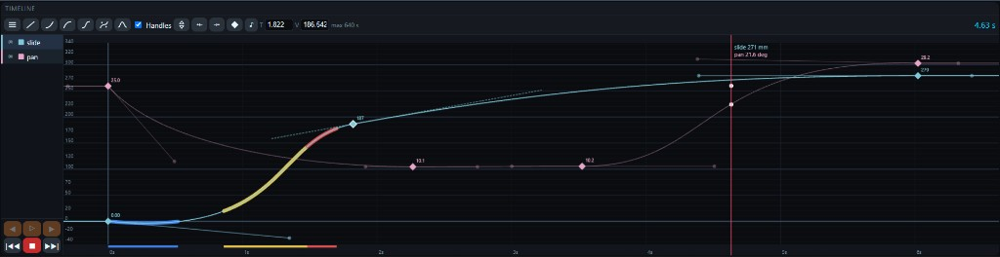

# Timeline panel

The Timeline panel is a curve editor for **keyframed slider motion**. Each motor axis has its own lane (a colored F-curve). You place keys, shape the interpolation between them, then play the result as a Motion Path on the motors.

The panel is available on a **wide (PC) layout** only. On a phone-width window the Timeline panel is not shown.

This is not Timeline **Play**. Play samples the curves and sends a path that dies if the browser sleeps. Desktop **Timelapse → ⏲ Start** reuses the same F-curves as a host task (FPS raster, `PS × FACTOR` or MSM hops).

---

## Layout

The panel has a toolbar and a graph canvas. There is **no caption**. Axis names, eye/lock, jog, and play buttons live on the [Control](ctrl-panel-manual.md) strip below.



### Toolbar

From left to right:

- **Menu** — same import/export and Change Time list as the Control hamburger.
- **Interpolation icons** — Auto, Aligned, Free, Linear (sticky handle modes), then Ease in / Ease out / Ease in/out (presets on the selected key). Square buttons, same size as Control.
- **Handles** — switch: show or hide Auto / Aligned / Free / Linear handles on the graph.
- **Follow** — switch (default **on**): with Follow on, a motor-seek (right-click, Ctrl+left) uses a Motion Path when the motors are on the curve. With Follow **off**, those clicks `MT` unless **Ctrl** is down. Ctrl+playhead keys always path.
- **Fit** — zoom time to the keys, and the Y scale of the **active** lane.
- **●** — add a marker at the playhead (opens the marker dialog).
- **T** / **V** — time (seconds) and value of the selected key. **T** is locked for the key at `t = 0`.
- **max N s** — longest path the controller can store at the current path frequency.
- Playhead time (`0.00 s`) and frame (`1 F`). Frame is `round(time × FPS) + 1` using Config **Frame rate**. At `t = 0` the frame is **1 F**. Ochre dashed numbers: click time to type seconds, or frame to type a 1-based frame; **Enter** moves the **red** playhead only (motors stay). **Escape** cancels. Same as a graph left-click.

Prev / next key, Key, Play, and stop are on [Control](ctrl-panel-manual.md).

### Canvas

- **Top strip** — markers (orange circles with a symbol).
- **Graph** — keys (circle / diamond / square by mode), curves, handles, origin-aligned grid, and a hollow live-pose circle (curve colour) when motors report a position.
- **Bottom ruler** — time in seconds, plus blue / yellow / red limit bands.
- **Playhead** — vertical **red** line at the current / target time. A HUD next to it lists name, value, and unit for every visible lane. A **green** line (no HUD) is the path clock while a path-to-playhead seek is running.

The **Y grid** follows the **active** lane (mm or deg, same numbers) and is always anchored at **0**:

- very thin lines every **10**
- thin lines every **50** (same weight as the old even grid)
- normal lines every **100**
- a thicker line at **0**

The **X grid** is anchored at **t = 0**:

- very thin lines every **1 s**
- thin lines every **5 s**
- normal lines every **10 s**
- a thicker line at **0 s**

If a level would sit closer than about 8 px, it is hidden (finest first). Numeric labels prefer 0, then 100 / 10 s, then 50 / 5 s, then 10 / 1 s, and skip any label that would overlap.

---

## Navigating the graph

| Action | Result |
| --- | --- |
| Left-click empty graph | Move the **red** playhead. Preview only — motors do **not** move. |
| Right-click empty graph | Set the red playhead and move motors. **Follow on** (or Ctrl): path along the curve if live pose matches the old playhead, else `MT`. **Follow off** and no Ctrl: `MT`. The red line jumps to the click; a **green** line clocks the path. Drag-scrub uses throttled `MT`. |
| Ctrl+left-click empty graph | Same motor-seek as right-click, but **Ctrl forces path** even if Follow is off. |
| Drag the playhead | Same as click: left = preview; right / Ctrl-left = `MT` while dragging. Snaps to the nearest **visible** key if you are within **0.15 s**. Hold **Shift** to scrub with no snap. |
| **⤝** / **⤞** | Previous / next visible key. Left-click: playhead only. Right-click: playhead and motors (same Follow / Ctrl rule as a graph right-click). |
| Middle-button drag | Pan time and the Y view of every **visible** lane. |
| Mouse wheel | Zoom time, anchored at the cursor. Clamped to the maximum duration. |
| Ctrl + mouse wheel | Zoom the **active** lane’s Y scale, anchored at the cursor. |
| **Fit** | Zoom time to all keys. Y-fit applies to the active lane only. |

The graph never shows time below 0 or past **max N s**.

---

## Keys

A key is a mark on a curve: a time and a value. Shape depends on the mode (circle, diamond, or square). Every lane always has a key at **t = 0**. That key’s **value** is editable; its **time** is not. You cannot delete it.

### Select and move

- Click a diamond / circle / square to select it. A white outline marks the selection. **T** and **V** fill in. If two or more keys overlap, the **active** curve’s key (or handle) is selected. Click the axis name first to choose which stacked key you want.
- Drag a key to change time and value. The start key (`t = 0`) only moves in value.
- Time snap: while dragging, the key sticks to the **playhead** or to **0 s** if you are within **0.15 s**. Hold **Shift** for free time.
- Value is clamped to that axis’s physical travel (`slider_min` / `slider_max`). Shift does not bypass this.
- Drag a **marker** left or right in the top strip to change its time. Right-click a marker to open its dialog.

### Add

- **Double-click empty graph** — add a key on the **active** lane at that time and value (**Auto**).
- **Key** — for every **visible** lane, write the **live** motor pose at the playhead. If a key already sits within about 0.05 s of the playhead, that key’s value is updated instead of adding a new one. The new key copies the mode of the previous key on that lane.

### Edit value

- Double-click a key — overlay field on the canvas. Enter commits; Escape cancels.
- Or type in **V** (and **T** when the key is not at t = 0) and leave the field.

### Delete

**Delete** or **Backspace** (not while typing in a field):

- removes the selected key if its time is greater than 0
- removes the selected marker

The t = 0 keys stay.

---

## Interpolation

Select a key, then click a mode or an ease preset. Every key is a cubic Bézier. The mode only constrains **this key’s** handles. The span between two keys uses the left key’s **out** handle and the right key’s **in** handle.

**Sticky modes** (shape of the key on the graph):

- **Auto** — hollow **circle**. In and out have the same slope. Handles are dashed with no dots and are rebuilt whenever neighbours move. Consecutive Auto keys are solved as one C2 spline that **locks the neighbouring keys’ existing Bézier handles** (Blender Continuous Acceleration — not Catmull-Rom through key positions). Grabbing a handle without Alt moves the key; **Alt + drag** a handle converts the key to Aligned.
- **Aligned** — filled **diamond**. In and out keep the same **slope** (`dy/dx`); each side keeps its own time length (`|dx|`). Solid handles with dots. Yours — not overwritten. Flattening one handle does not throw the other across the graph.
- **Free** — filled **square**. In and out are independent (a corner). Solid handles with dots.
- **Linear** — hollow **diamond**. Handles point at the previous / next key and are rebuilt when neighbours move. Dashed, no dots. A span is fully straight only if **both** ends are Linear (or vector-snapped). **Alt + drag** a handle converts to Aligned.

Hollow = computed (Auto, Linear). Filled = you own the handles (Aligned, Free).

**Ease presets** (one-shot, selected key only). They flatten handles, then leave the key Aligned if both sides share a slope, otherwise Free:

- **Ease in** — flatten the **in** handle (arrive at this key).
- **Ease out** — flatten the **out** handle (leave this key).
- **Ease in/out** — flatten both. Handle **length** is the amount of ease (about one third of the span).

Ease in/out mean **into / out of this key**, not a remap of the whole span to the next key. A typical rest→rest move: Ease **out** on the first key, Ease **in** on the last.

Legacy files (`ease_*`, `bezier`, `smooth`) still load as **version 1**. They are baked to handles on import.

### Handle shortcuts

- **Ctrl + drag** a handle — keep `dy = 0` (horizontal through the key). Latched for the whole drag.
- **Shift + drag** — move both handles of this key the same **distance** (symmetrical, collinear). On an Aligned key, Shift only equalizes length.
- **Ctrl + Shift** — horizontal and symmetrical.
- **Alt + drag** — snap this handle onto the chord toward the neighbour (as linear as possible). Does not rewrite the other key.

Turn **Handles** off if the graph is cluttered. Keys and the curve stay visible.

---

## Playback

Play samples the curves at the **path frequency** and sends a Motion Path to the controller. The red playhead in the GUI follows in real time.

Transport lives on [Control](ctrl-panel-manual.md):

- **|◀◀** — jump the playhead to 0 s and seek the motors there at maximum speed and acceleration (`silent` `SS`/`SA`). Session cruise is **restored** when idle.
- **▶▶|** — jump to the last **motion** key and seek there the same way.
- **▶** — play from 0 s to the end (last key or last marker, whichever is later).
- **▷** — play from the **current playhead** to the end. Does nothing if the playhead is already at the last motion key.
- **◁** — play reverse from the playhead.
- **◀** — play the whole path **backwards** (deltas reversed).
- **⏹** — stop. Cancels a running path (Play or a path-to-playhead seek) **and** a preroll seek that has not started the path yet. On a path-to-playhead seek the **red** playhead stays at the click target; the green clock line disappears. Play still leaves the red playhead where its clock stopped.

### Path vs `MT` seek

A motor-seek (graph right-click, Ctrl+left-click, Control **prev/next** right-click, Ctrl+playhead keys) uses a **Motion Path** when **Follow** is on **or** **Ctrl** is down, **and** the motors are already on the timeline or match the curve at the **old** playhead (within **0.1** per visible axis). Otherwise it jumps with `MT`. Left-click without Ctrl never moves motors.

On a path seek the **red** playhead jumps to the click time (HUD / Ctrl Pose stay there). A **green** line clocks `fromT → toT` for the path duration. When that clock finishes, `SE 1` + `MT` retargets to the red playhead pose so leftover path speed / MC decel does not overshoot. **⏹** aborts the path and does **not** send that retarget `MT`.

A **visible** axis already within **1.0** of the curve gets a small first-slice correction. Hidden lanes and large offsets are not yanked through the path. Jog, joystick, Home, or A/B moves leave the curve, so the next path attempt falls back to `MT`.

### Preroll

If the live pose is more than **0.1** (per-axis unit) away from the pose Play would start at, the app first seeks there at max speed, waits until the motors are idle, waits **one more second**, then starts the path. **⏹** during that wait cancels the start.

### Markers

**●** plants an orange circle at the playhead and opens the marker dialog. Left-drag the circle to change time. Right-click it to edit again. The symbol you set in the dialog is drawn on the circle.

When Play’s playhead **crosses** a marker (forward or reverse), every **enabled** action on that marker fires:

| Action | What happens |
| --- | --- |
| **Beep** | SliderMC `BE` (buzzer) and a short browser tone |
| **Bloop** | Pico host `PIN_BLOOP` (GP14) goes **HIGH for 100 ms**, then LOW. Push-pull; idle is LOW. No-op on a PC host (no GPIO). |
| **Ext 1–4 set to 0/1** | SliderMC `EO1`…`EO4` with that level. The pin **stays** at that level until another marker (or Test) changes it. |
| **Trigger Camera** | SliderMC `CT` (about 100 ms on the MC camera pin) |

**Test** in the dialog fires the same actions immediately. **Delete** (red) removes the marker. Changes apply as you tick boxes; close with Escape or a click on the dimmed backdrop.

A marker with nothing ticked is only a visual cue. Markers do not move the motors. They can extend the play clock past the last motion key, so a late action still fires.

Old files with `{ "kind": "beep" }` load as beep-on, symbol **B**.

---

## Speed, acceleration, and travel limits

The editor scans visible lanes at the path frequency, the same way Play will sample them.

- **Blue** — pose outside that axis’s physical travel (`slider_min` / `slider_max`, the axis `min` / `max` from the rig or hello).
- **Yellow** — speed above that axis’s `max_spd`.
- **Red** — acceleration above that axis’s `max_acc`.

The highlight is a thick stroke **behind** the curve and a band on the **time ruler**. Limits come from the rig / hello message.

If any visible lane is over the limit (including travel), **▶**, **▷**, and **◀** are **disabled**. Fix the curve (or hide the offending lane) before you can play.

---

## Path frequency and maximum duration

**Path frequency (Hz)** lives in **Config**, directly under **Frame rate**. Default **50**. Allowed range **10–200**.

This is the sample rate of Play and of the blue/yellow/red scan — not the editorial frame rate used for Maya export.

Maximum duration:

```text
max seconds  ≈  path buffer size  /  path frequency
```

The toolbar shows that as **max N s**. Keys, zoom, and time-scale operations cannot go past it. Raising Hz is **refused** if the last key would no longer fit.

**Frame rate** (also in Config) is only used when exporting a Maya camera (one sample per editorial frame).

---

## Menu

**Menu** (first toolbar control):

- **Import Timeline** — load a `*.timeline.json`. You get a confirm prompt; then lanes, markers, and path frequency are **replaced**. Layout, panel visibility, and project name stay. Generic project JSON is rejected.
- **Export Timeline** — save `{name}.timeline.json` (keys, handles, markers, Hz). See the appendix.
- **Export CSV** — save `{name}_timeline.csv`, sampled at the path frequency. See the appendix.
- **Export Maya Camera** — save `{name}.ma` for Fusion / Resolve. See the appendix.
- **Change Time…** — open the timing dialog.

---

## Change Time

**Menu → Change Time…** opens a dialog. Each row has its own **Set**. Set applies at once and leaves the dialog open so you can chain operations. Key **values** never change — only times.

On open, **Scale time to** is the current duration. After a successful Set:

- percent returns to **100**
- **Scale time to** shows the new duration
- **Move by** returns to **0**

### Scale time by %

`200` makes the path take **twice** as long; `50` makes it half. Rejected if the value is ≤ 0. Clamped to 1–1000.

Times (keys, markers, playhead) multiply by `percent / 100`. Handle time-offsets (`dx`) scale the same way so slopes stay correct (motors simply run slower or faster). Handle `dy` is unchanged.

### Scale time to

Enter the desired **end time** in seconds. Same as scaling by `target / current duration`. Refused if the target is ≤ 0 or the timeline has no motion.

### Move by

Shift the whole shot later (positive) or earlier (negative), in seconds.

A **positive** move creates a **hold** at the start: the t = 0 key stays and keeps the first pose, so the rig waits, then the original motion plays. Example: a 0–6 s move shifted by +2 s becomes a flat 0–2 s, then the original curve from 2–8 s.

A **negative** move eats into that hold. It is **refused** if a real key would land before 0 s.

### Refusals

If the result would exceed **max N s**, or a move would push keys/markers below 0 s, nothing is applied and an alert explains why.

Fit is **not** run after a change. Use **Fit** if you want the view to match the new duration.

---

## What is saved

Edits are written to the project in the browser (lanes, markers, path frequency). **Config → Save project** still stores the **whole** GUI project (layout + timeline). Timeline **Menu → Export Timeline** is the timeline-only file.

**Import Timeline** does **not** change the rig or motor configuration. Axis names/units from the rig are reapplied after import.

---

## Appendix: file formats

### SliderMoCo timeline — `{name}.timeline.json`

Proprietary exchange file for this panel. **Menu → Export Timeline** / **Import Timeline**.

It is **not** a full project file. No layout, no panel visibility. Import requires `"format": "slidermoco-timeline"` (or the older `"sliderhost-timeline"`) and a `lanes` array.

Typical contents:

- `format`, `version` (currently 1)
- `name` — copied from the project name (informational)
- `play_hz` — path frequency
- `markers` — `{ "t": seconds, "symbol": "B", "beep": true, "bloop": false, "camera": false }` plus optional `ext1`…`ext4` (`0` or `1` when that Ext action is enabled). Legacy `{ "kind": "beep" }` still loads.
- `lanes` — per axis: `id`, `name`, `unit`, and `keys`
- each key: `t`, `value`, `interp` (`auto`, `aligned`, `free`, `linear`; legacy `smooth`→`auto`, `bezier`→`free`, `ease_*` baked on load), plus `in` / `out` handles `{ dx, dy }`
- `axes` — informational copy of rig/hello limits (`min`, `max`, `max_spd`, `max_acc`). **Ignored on import.**

Use this file to archive a shot or move it between machines. Use **Save project** when you also want the window layout.

### Sampled CSV — `{name}_timeline.csv`

One-way dump for spreadsheets or analysis. **Not** importable.

- Sampled from `t = 0` to the last motion key at `dt = 1 / path frequency`.
- UTF-8, comma-separated, three decimal places.
- Header: `Time,Pos1,Spd1,Acc1,Pos2,Spd2,Acc2,...` — the number is the lane **id**.
- `Time` in seconds.
- `PosN` is the evaluated curve.
- `SpdN` / `AccN` are the same finite differences as the yellow/red scan (`0` on the first samples).
- **All** lanes are exported, including hidden ones.

### Maya ASCII camera — `{name}.ma`

Baked camera for DaVinci Resolve Fusion (and other apps that read Maya ASCII cameras). **Export only.**

SliderMoCo writes a Maya 5-style `.ma` with a `sliderCam` node. Curves are **sampled** at the project **Frame rate** (not path Hz), one key per frame, linear tangents. Frame 1 is `t = 0`.

Lane names (case-insensitive) map to camera channels. First match wins; unmapped channels stay at 0:

- `slide` / `dolly` / `track` / `x` → Translate X, **mm ÷ 10 → cm**
- `height` / `lift` / `elev` / `y` → Translate Y (mm → cm)
- `z` → Translate Z (mm → cm)
- `tilt` / `rx` → Rotate X (degrees)
- `pan` / `ry` → Rotate Y (degrees)
- `roll` / `rz` → Rotate Z (degrees)

The default two-axis rig (`slide` + `pan`) is a nodal pan on a lateral rail: camera at `(slide_cm, 0, 0)`, rotation `(0, pan, 0)`, looking down −Z.

**In Fusion / Resolve:** add a Camera 3D node → Inspector → **Import Camera…** → pick the `.ma` file.

Maya ASCII itself is Autodesk’s scene text format. Fusion’s Import Camera path, including Maya `.ma` support, is described here: [Importing Cameras](https://www.steakunderwater.com/VFXPedia/__man/Fusion18-6/Fusion18_Manual_files/part732.htm) (Fusion manual, VFXPedia).

---

## Related

- [Control](ctrl-panel-manual.md) — transport, axis rows, session sliders.
- [Keyboard](keyboard-control-manual.md) — playhead keys, Key, Play.
- [Import / export](import-export-manual.md) — Timeline menu.
- [Timelapse](timelapse-panel-manual.md) — ⏲ Start uses these F-curves.
